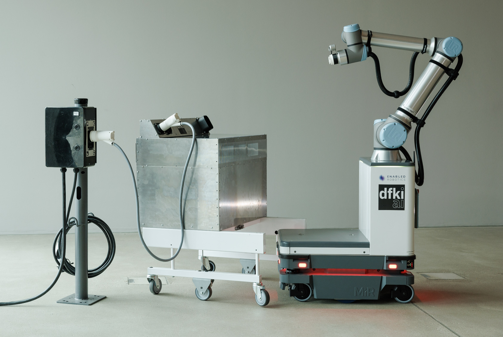
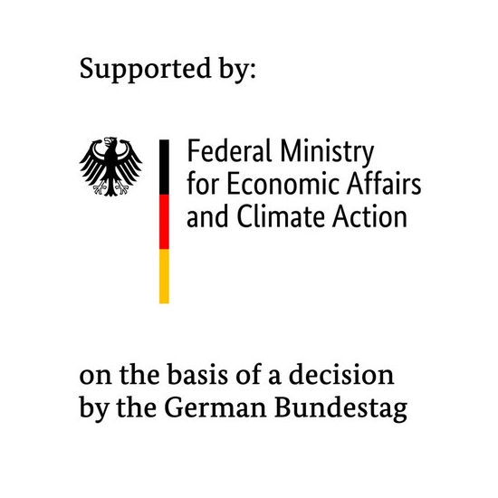

# DFKI-ChargePal

This GitHub Organization holds all the public code developed during the [ChargePal project](https://www.dfki.de/en/web/research/projects-and-publications/project/chargepal).

<figure>
    
    <figcaption>ChargePal robot platform and battery cart (© DFKI, Friso Gentsch)</figcaption>
</figure>

This work is carried out as part of the ChargePal project through a grant of the German [Federal Ministry for Economic Affairs and Climate Action](https://www.bmwk.de/Navigation/EN/Home/home.html) (BMWK) with the grant number 01ME19003.

